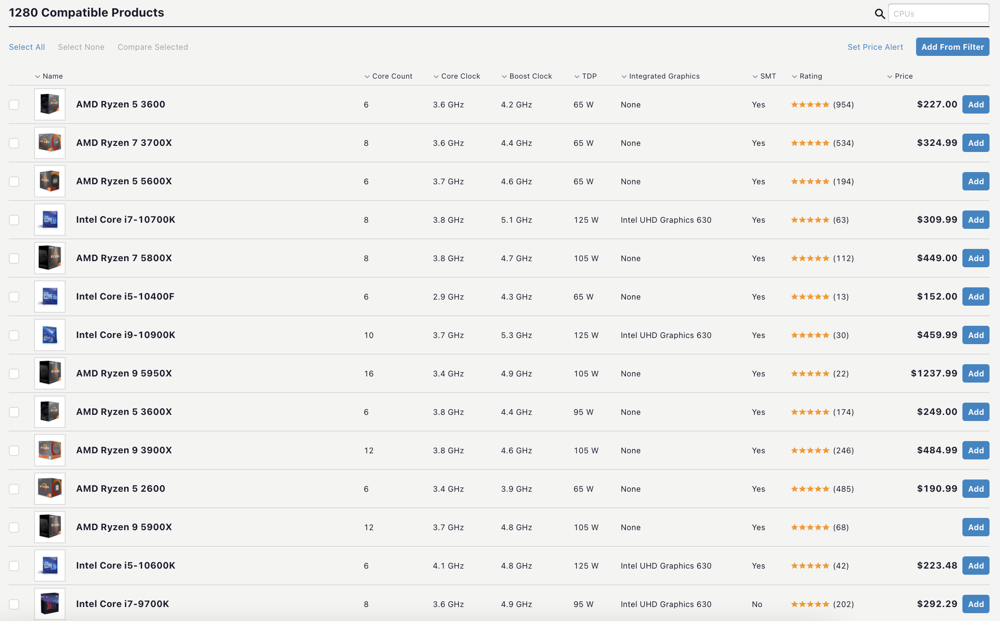

# Making PC Building More Beginner Friendly 
## Assignment01: Heuristic Evaluation
### DH110, Joie Cao

About 6 months ago, I built my first PC. Before, I had used Macs all my life and I had absolutely no experience in finding the right parts and construction. The experience was extremely overwhelming, and I wouldn't have been able to accomplish it without the help of a more knowledgable friend. Now that I know a bit more about PCs, I want to help others with their new PC builds. Two websites were very helpful to me when I was learning about parts: PC Part Picker and Logical Increments. However, these sites are not perfect and can still be very overwhelming as they use many technical words and unfamiliar names. I want to make PC building more straight forward and simple, especially for inexperienced first time builders. 

### Severity Rating 
0 = I don't agree that this is a usability problem at all

1 = Cosmetic problem only: need not be fixed unless extra time is available on project

2 = Minor usability problem: fixing this should be given low priority

3 = Major usability problem: important to fix, so should be given high priority

4 = Usability catastrophe: imperative to fix this before product can be released

Credit: https://www.nngroup.com/articles/how-to-rate-the-severity-of-usability-problems/

## [PC Part Picker](https://pcpartpicker.com/list/)

This site is a system builder. It lists all the components of a PC and allows you to select the desired parts. If for example the builder was looking for a CPU, they could select a CPU from a list with reviews and prices, then add it to their build. The site then checks for compatibility between parts. The site is also great for sharing PC builds with friends. My personal build is here: https://pcpartpicker.com/list/Rfm8dD

### Overall Evaluation 
PC Part Picker is a great site for those who already know what they're doing. Where it fails however is in the recommendation of parts. If we go back to the CPU selection screen, a first time user would be overwhelmed with hundreds of different CPUs. How could a new user know the difference between an Intel i9 or i5? Why are there so many different versions of the AMD Ryzen 5, 7, and 9? Why do the prices range from a couple hundred dollars to over a thousand? What is core count and why does it matter? All these questions stem from just one screenshot. 

### Heuristic Evaluation 
|Heuristic|Severity Rating|Evaluation|Recommendation|
|---|---|---|---|
|1) Visibility of system status|3|All essential PC parts are listed and it is clear where to click to add a component. However, many unnecessary parts are also highlighted with equal importance, such as external storage and laptop.|Only show the most essential components and move the lesser components into a seperate add-on category|
|2) Match between system and real world|3|Full of tech jargon|Add a small note or explanation next to each component|
|3) User control and freedom|2|Adding a component takes you to a new page. Removing a component is fairyly straightforward.|Perhaps there should be a way to quickly add a new component without having to go to a new page and see a wall of random parts.|
|4) Consistency and standards|2|Very prevalent use of green. Green makes sense when used for the compatibility icon, but not so much for the price. It gives the illusion that the current price for the part is reasonable where in reality the prices listed by the site is often inaccurate or higher than normal. This is probably due to the site having affiliate links and wanting to encourage users to buy.|Make prices and buy button a different color, maybe yellow or blue.|
|5) Error prevention|0|Clickable areas are clear and back buttons are assessable|Good|
|6) Recognition rather than recall|3|No images of components on front page. When taken to a page with parts, the thumbnails are absolutely tiny and it's difficult to recognize or recall anything.|Add graphics for each component and make the thumbnails bigger.|
|7) Flexibility and efficiency of use|2|Shortcuts are not aparent and it is not immediately clear you can actually add more than one component per category or compare components.|Make these helpful tools larger and more more visable, especially the "compare" button.|
|8) Aesthetic and minimalist design|3|The design is a bit outdated and shows way too much text to be considered "minimal." |Update graphics and color palette, simplify the design with less unnecessary text. Make component selection screen look more like a catalogue than a spreadsheet.|
|9) Help users recognize, diagnose, and recover from errors|0|When a build is not compatible or a part is too old, it clearly shows in red that something isn't working.|Good|
|10) Help and documentation|2|Build guides are at the top of the page but offers no explanation of each component.|Add more informative pages that explain different components.|

## [Logical Increments](https://www.logicalincrements.com/)

This site is also a system builder, however the key difference is that it provides logical increments in the parts a user should buy based on their budget and computational needs. The site offers tailored guides for what kind of PC the user is trying to build, such as for gaming, video editing and art/design. At the bottom of the site, there is a brief explanation of each part and what they do. 

### Overall Evaluation 
I find this site more educational than PC Part Picker. It does not assume the user knows everything about PCs and offers a very reasonable roadmap for what parts they should purchase. However, the site still has some of the same issues as PC Part Picker, such as the large wall of unfamiliar names that confront the user as soon as they load the page. 

### Heuristic Evaluation 
|Heuristic|Severity Rating|Evaluation|Recommendation|
|---|---|---|---|
|1) Visibility of system status|2|The site is very clear with showing essential parts and prices, however the hierarchy of text makes the highest recommendation blend into the lower recommendations.|BOLD the top recommendations or make the text larger|
|2) Match between system and real world|2|Great visual graphics for each component and build tier. However, there is still a lot of tech jargon and the explanation for everything is at the bottom of the page.|Create shortened explanations for each component and allow it to show when the mouse is hovered over the graphic.|
|3) User control and freedom|1|Easy "expand" and "collapse" buttons for more details|Make the clickable area bigger|
|4) Consistency and standards|0|Use of visual language is very consistent with expectations. Arrow directions make sense, colors are coordinated and consistent.|Good|
|5) Error prevention|0|Clickable areas are clear and back buttons are assessable|Good|
|6) Recognition rather than recall|0|Very well made icons/graphics for components and tiers, large thumbnails when hovering over product.|Good|
|7) Flexibility and efficiency of use|2|When hovering over a product, more details are shown. This is a nice feature, however it also prevents the user from comparing two models side to side. They would have to keep switching from hovering over one to the other.|Add a compare features function.|
|8) Aesthetic and minimalist design|2|While the design is minimal, there is still a lot of text that is very overwhelming. There is also no official home page with navigation to other pages.|Create a central home page and reorganize hierarchy of text within each tier.|
|9) Help users recognize, diagnose, and recover from errors|3|The site does not have the ability to determine for the user if 2 parts are compatible. It does show compatibility sockets but the user must check for themselves if 2 pieces work.|Integrate a compatibility mode like PC Part Picker|
|10) Help and documentation|1|The site offers many resources and build guides. However some of the most essential information is at the bottom of the page.|Rearrange page to show essential info at the top.|

Thank you for coming to my Ted Talk. 
