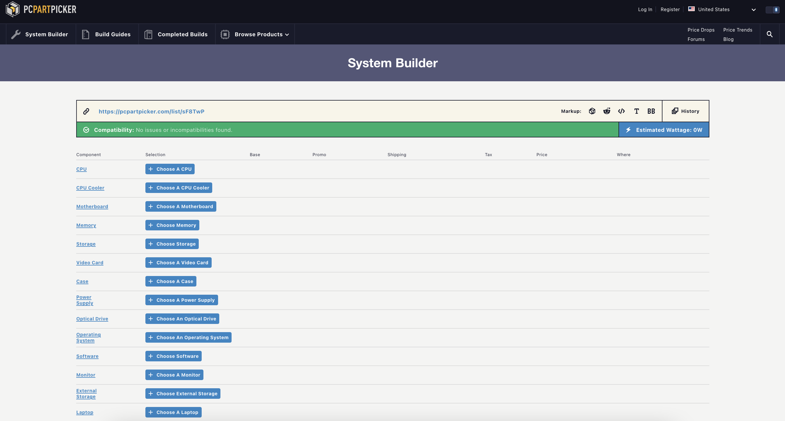
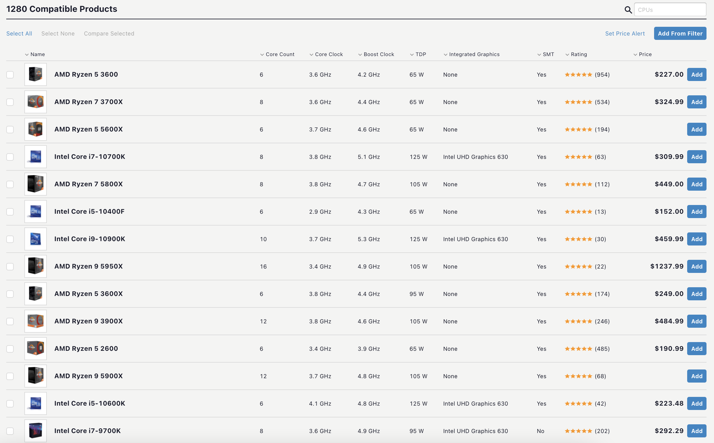

# Making PC Building More Beginner Friendly 
## Assignment01: Heuristic Evaluation
### DH110, Joie Cao

About 6 months ago, I built my first PC. Before, I had used Macs all my life and I had absolutely no experience in finding the right parts and construction. The experience was extremely overwhelming, and I wouldn't have been able to accomplish it without the help of a more knowledgable friend. Now that I know a bit more about PCs, I want to help others with their new PC builds. Two websites were very helpful to me when I was learning about parts: PC Part Picker and Logical Increments. However, these sites are not perfect and can still be very overwhelming as they use many technical words and unfamiliar names. I want to make PC building more straight forward and simple, especially for inexperienced first time builders. 

## [PC Part Picker](https://pcpartpicker.com/list/)

This site is a system builder. It lists all the components of a PC and allows you to select the desired parts. If for example the builder was looking for a CPU, they could select a CPU from a list with reviews and prices, then add it to their build. The site then checks for compatibility between parts. The site is also great for sharing PC builds with friends. My personal build is here: https://pcpartpicker.com/list/Rfm8dD

### Overall Evaluation 
PC Part Picker is a great site for those who already know what they're doing. Where it fails however is in the recommendation of parts. If we go back to the CPU selection screen, a first time user would be overwhelmed with hundreds of different CPUs. How could a new user know the difference between an Intel i9 or i5? Why are there so many different versions of the AMD Ryzen 5, 7, and 9? Why do the prices range from a couple hundred dollars to over a thousand? What is core count and why does it matter? All these questions stem from just one screenshot. 

