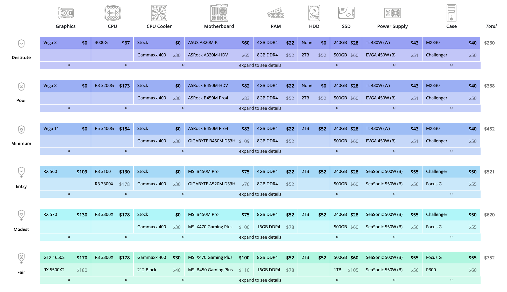
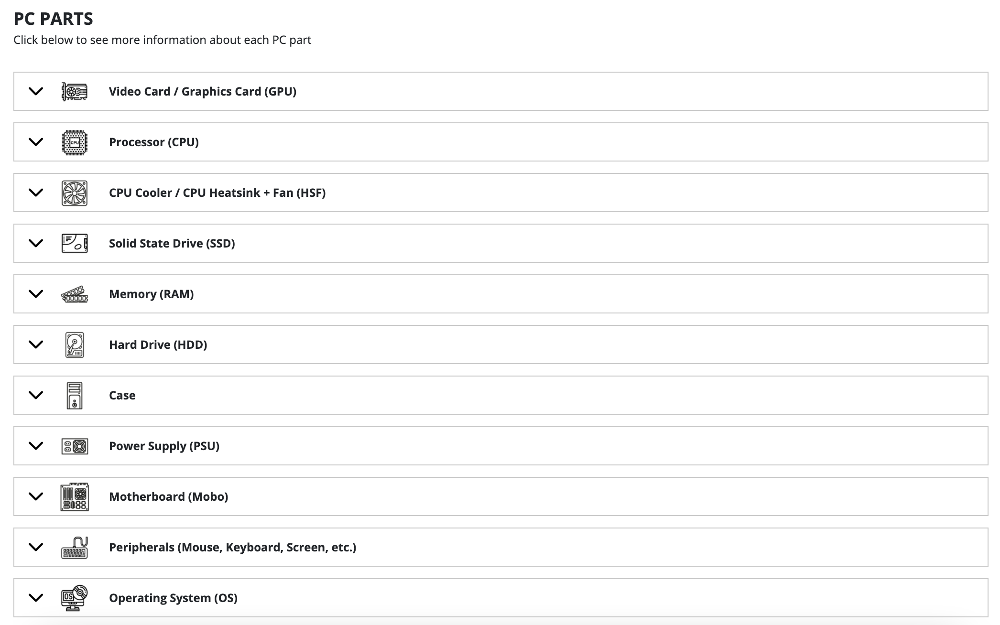
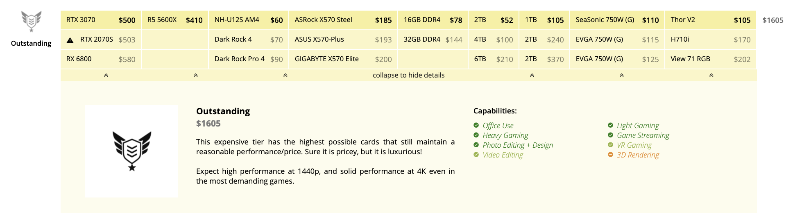

# Making PC Building More Beginner Friendly 
## Assignment01: Heuristic Evaluation
### DH110, Joie Cao

About 6 months ago, I built my first PC. Before, I had used Macs all my life and I had absolutely no experience in finding the right parts and construction. The experience was extremely overwhelming, and I wouldn't have been able to accomplish it without the help of a more knowledgable friend. Now that I know a bit more about PCs, I want to help others with their new PC builds. Two websites were very helpful to me when I was learning about parts: PC Part Picker and Logical Increments. However, these sites are not perfect and can still be very overwhelming as they use many technical words and unfamiliar names. I want to make PC building more straight forward and simple, especially for inexperienced first time builders. 

### Severity Rating 
0 = I don't agree that this is a usability problem at all

1 = Cosmetic problem only: need not be fixed unless extra time is available on project

2 = Minor usability problem: fixing this should be given low priority

3 = Major usability problem: important to fix, so should be given high priority

4 = Usability catastrophe: imperative to fix this before product can be released

Credit: https://www.nngroup.com/articles/how-to-rate-the-severity-of-usability-problems/

## [PC Part Picker](https://pcpartpicker.com/list/)

This site is a system builder. It lists all the components of a PC and allows you to select the desired parts. If for example the builder was looking for a CPU, they could select a CPU from a list with reviews and prices, then add it to their build. The site then checks for compatibility between parts. The site is also great for sharing PC builds with friends. My personal build is here: https://pcpartpicker.com/list/Rfm8dD

### Overall Evaluation 
PC Part Picker is a great site for those who already know what they're doing. Where it fails however is in the recommendation of parts. If we go back to the CPU selection screen, a first time user would be overwhelmed with hundreds of different CPUs. How could a new user know the difference between an Intel i9 or i5? Why are there so many different versions of the AMD Ryzen 5, 7, and 9? Why do the prices range from a couple hundred dollars to over a thousand? What is core count and why does it matter? All these questions stem from just one screenshot. 

### Heuristic Evaluation 
|Heuristic|Severity Rating|Evaluation|Recommendation|
|---|---|---|---|
|1) Visibility of system status|   |   ||
|2) Match between system and real world|   |   ||
|3) User control and freedom|   |   ||
|4) Consistency and standards|   |   ||
|5) Error prevention|   |   ||
|6) Recognition rather than recall|   |   ||
|7) Flexibility and efficiency of use|   |   ||
|8) Aesthetic and minimalist design|   |   ||
|9) Help users recognize, diagnose, and recover from errors|   |   ||
|10) Help and documentation|   |   ||

## [Logical Increments](https://www.logicalincrements.com/)

This site is also a system builder, however the key difference is that it provides logical increments in the parts a user should buy based on their budget and computational needs. The site offers tailored guides for what kind of PC the user is trying to build, such as for gaming, video editing and art/design. At the bottom of the site, there is a brief explanation of each part and what they do. 

### Overall Evaluation 
I find this site more educational than PC Part Picker. It does not assume the user knows everything about PCs and offers a very reasonable roadmap for what parts they should purchase. However, the site still has some of the same issues as PC Part Picker, such as the large wall of unfamiliar names that confront the user as soon as they load the page. 

### Heuristic Evaluation 
|Heuristic|Severity Rating|Evaluation|Recommendation|
|---|---|---|---|
|1) Visibility of system status|   |   ||
|2) Match between system and real world|   |   ||
|3) User control and freedom|   |   ||
|4) Consistency and standards|   |   ||
|5) Error prevention|   |   ||
|6) Recognition rather than recall|   |   ||
|7) Flexibility and efficiency of use|   |   ||
|8) Aesthetic and minimalist design|   |   ||
|9) Help users recognize, diagnose, and recover from errors|   |   ||
|10) Help and documentation|   |   ||

Thank you for coming to my Ted Talk. 
